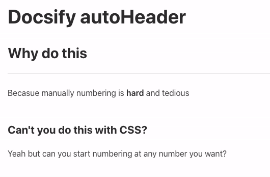

# docsify-autoHeaders: Auto numbering body headings

   

This plugin is designed to create heading numbers in your pages if you are creating a reference guide. It stops you from having to manually number the items, and then have to then trawl through every heading afterwards to change the numbering system again. It allows you to either have all the headings in one page, or if you split them over many markdown documents then specify what the heading number it should be starting at.



## Installation

### 1. Update `index.html` file

Assuming you have a working [docsify](https://docsify.js.org/) framework set up, it is easy to use the plugin.

1. Add the following script tag to your `index.html` via either CDN or downloading it and using it locally:

 ```html
 <!-- unpkg.com -->
 <script src="https://unpkg.com/docsify-autoheaders"></script>

 <!-- jsDelivr -->
 <script src="https://cdn.jsdelivr.net/npm/docsify-autoheaders"></script>

 <!-- locally -->
 <script src="docsify-autoheaders.js"></script>
 ```

1. In docsify setup configure the plugin:

 ```js
<script>
window.$docsify = {
    autoHeading: {
        separator: '',
        levels:    '',
        scope:     ''
    },
};
</script>
```

There are some options available for the `docsify-autoHeaders`:

| setting   | options |
| :-------- | :------ |
| separator | how you'd like the numbers to be separated. `decimal`, `dash`, or `bracket`
| levels    | heading levels to target `1-6`
| scope     | the `ID` of the holding element. for docsify this is normally `#main` but I guess if you have `html` inside the `.md` then you can tie it to that instead

### 2. Usage

At the top of your file add the following snippet:

```md
@autoHeader:
```

At the end of the identifier, add the section starting number. If you don't have that it won't auto number (good for pages not needing numbering).

You can :heart: have a starting header at `0` using:

```md
@autoHeader:0
```

## Example

### Input data in `file.md`

```md
@autoHeader:34

# Black Books

## Season 2

### Episode 1

#### Characters
- Bernard
- Fran

#### Quotes
You! What have you been telling Kate? She thinks I'm
the renaissance. I have to go along with all this
"reclusive genius" stuff... she's going to be very
upset when she finds out I'm a reclusive wanker.
```

### Output data


## Contributing

1. Clone the repo:
 `git clone https://github.com/markbattistella/docsify-autoHeaders.git`

1. Create your feature branch:

 `git checkout -b my-feature`

1. Commit your changes:

 `git commit -am 'Add some feature'`

1. `Push` to the branch:

 `git push origin my-new-feature`

1. Submit the `pull` request
